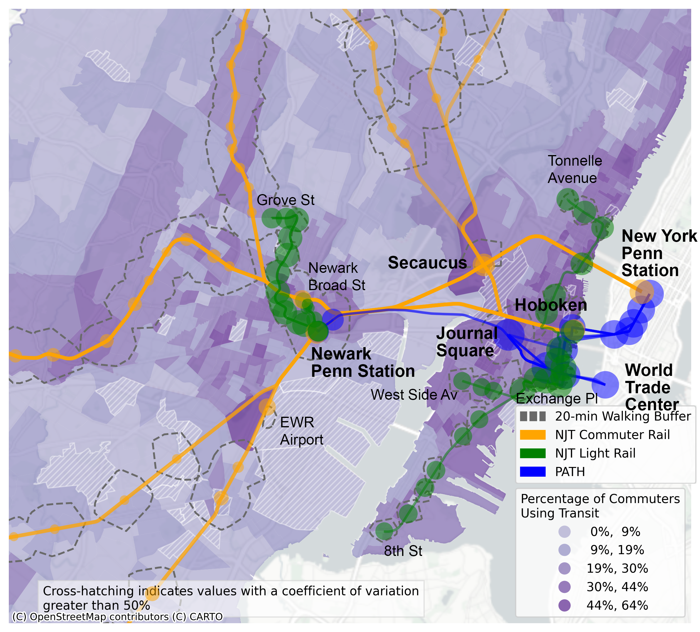

## Walking buffers for Northern New Jersey Rail Stations
595 Command-Line GIS Final Project, Spring 2024

### Map of rail station walking buffers in the Newark, Jersey City, Hoboken area. 
Size of station circles indicate the relative number of trains that stop at that station in a day.

### Map of bus stop density in the Newark, Jersey City, Hoboken area. 

### Interactive Map for Northern New Jersey
[Open this map as a new page](webmap_ver3.html).
<iframe src = "webmap_ver5.html" height = "800" width = "800"></iframe>

Code adapted from Dr. Will Payne and Dr. Geoff Boeing
Made with open data from static GTFS files and OpenStreetMap street network data
