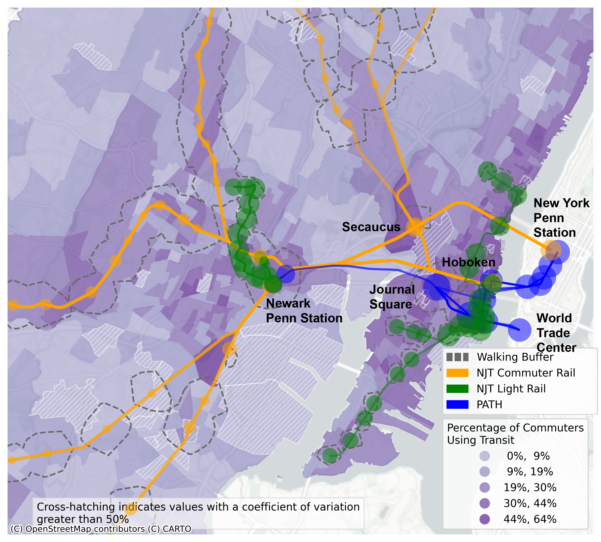
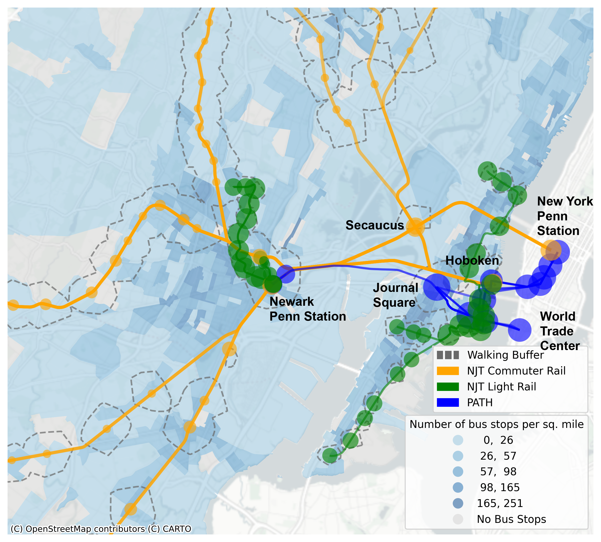
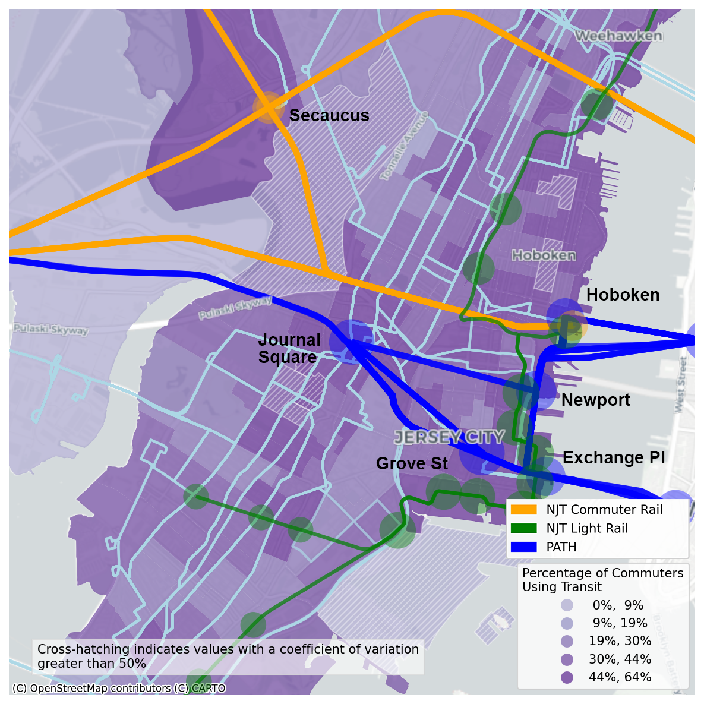

## Mapping Transit Service Supply and Transit Use in Northern New Jersey
595 Command-Line GIS Final Project, Spring 2024

### Rail Transit Service Availability shown on maps of Transit Use (left) and Bus Stop Density (right)
Size of station circles indicate the relative number of trains that stop at that station in a day.
Locale: Newark/Jersey City/Hoboken Area, NJ

This first set of maps compares rail transit service supply to transit use (left map, % of commuter riding transit) and to bus stops per square mile (right map, number of stops divided by area of the block group). On the left we see some weak correlation between rail corridors and high transit use, especially at large transit hubs such as Secaucus and Journal Square stations. However, there are still areas not served by rail that has a high proportion of transit commuters.

  
   

This observation inspired the second map (right), which takes into account bus transit supply measured by the number of bus stops per sq. mile. High bus stop density matches some of the high transit use areas, especially central Newark (west of Newark Penn Station) and along the northern portion of the Hudson River bank.

To show transit supply and use on a more granular level, I made another map with a larger scale zooming in at the Journal Square Transportation Center. This view allowed me to also show bus routes (light blue color), against a background showing transit use. One can observe bus routes serving the north-south travel direction and connecting high transit use neighborhood that are off the rail lines.

### Interactive Map for Northern New Jersey
Here's an interactive map showing rail stations, lines, and walking buffers for the Northern New Jersey region. You can click on each station to bring up a brief description of its name, system, and number of trains per day.

[Open this map as a new page](webmap_ver6.html).
<iframe src = "webmap_ver6.html" height = "800" width = "800"></iframe>

Code adapted from Dr. Will Payne and Dr. Geoff Boeing

### Some notes on methodology
I made this map with open data from static GTFS, OpenStreetMap, and publicly available American Community Survey 5-Year Estimates from 2021. Census geography boundaries were obtained from the [IPUMS NHGIS project](https://www.nhgis.org).

#### Rail stations, lines, and number of daily train departures
Transit agencies provide static GTFS (General Transit Feed Specification) files regularly to reflect their planned service pattern. For this exercise, I obtained data from New Jersey Transit and Port Authority Trans-Hudson (PATH) in the form of comma-delimited text files. I calculated the number of daily departures by selecting a typical week and counting all departures (described in the "stop_times.txt" file) from a particular station, using the pandas package. I then geocoded the stations and lines in geopandas to display them on a map.

#### Census data and shapes
I utilized the census package for python to access the U.S. Census API for block group level data. While population and area information is readily available, I had to calculate the percentage of transit commuters by dividing the number of transit commuters by all respondents who filled out the Means of Transportation to Work question. This also required the calculation of a new coefficient of variation (CV) for the percentage from the margin of error (MoE) measures.

#### Walking buffers
The OpenStreetMap NetworkX project provides an open-source pathway for building street network models. I used this feature to approximate walking buffers around rail stations. I selected a 20-min walk time for faster and longer-haul heavy rail transit, versus 10-min for slower and shorter-haul light rail lines.

#### Mapping
I created the static maps by plotting several GeoPandas GeoDataFrames onto one matplotlib.pyplot axes object. I used the folium package to create an html file describing the interactive map, then uploaded the code for display in GitHub Pages. Folium Marker and FeatureGroup classes were used to map the points and polygons, respectively.
